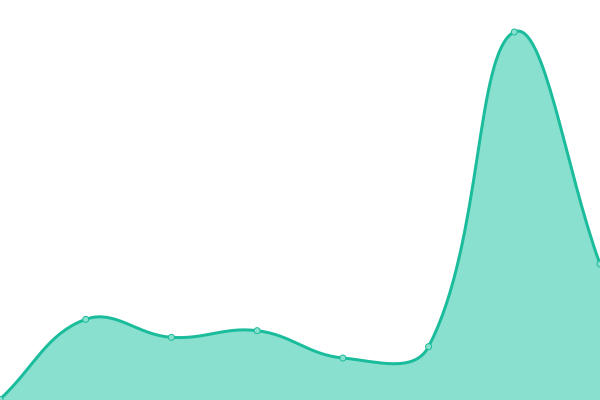

# [📈 Live Status](https://upptime.github.io/upptime): <!--live status--> **🟧 Partial outage**

This repository contains the open-source uptime monitor and status page for [Upptime](https://upptime.js.org), powered by [Upptime](https://github.com/upptime/upptime).

With [Upptime](https://upptime.js.org), you can get your own unlimited and free uptime monitor and status page, powered entirely by a GitHub repository. We use [Issues](https://github.com/upptime/upptime/issues) as incident reports, [Actions](https://github.com/trexstrix/react-test-todo-app-broken/actions) as uptime monitors, and [Pages](https://upptime.github.io/upptime) for the status page.

<!--start: status pages-->
<!-- This summary is generated by Upptime (https://github.com/upptime/upptime) -->
<!-- Do not edit this manually, your changes will be overwritten -->
<!-- prettier-ignore -->
| URL | Status | History | Response Time | Uptime |
| --- | ------ | ------- | ------------- | ------ |
|  Google | 🟩 Up | [google.yml](https://github.com/trexstrix/react-test-todo-app-broken/commits/HEAD/history/google.yml) | 

 101ms
     
 | 

<a href="https://trexstrix.github.io/react-test-todo-app-broken/history/google">100.00%</a>
    

|  docs | 🟥 Down | [docs.yml](https://github.com/trexstrix/react-test-todo-app-broken/commits/HEAD/history/docs.yml) | 

 0ms
     
 | 

<a href="https://trexstrix.github.io/react-test-todo-app-broken/history/docs">0.00%</a>
    

|  proxy | 🟥 Down | [proxy.yml](https://github.com/trexstrix/react-test-todo-app-broken/commits/HEAD/history/proxy.yml) | 

 0ms
     
 | 

<a href="https://trexstrix.github.io/react-test-todo-app-broken/history/proxy">0.00%</a>
    

<!--end: status pages-->

[**Visit our status website →**](https://upptime.github.io/upptime)undefined
