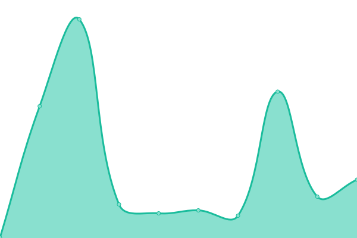

# 

<!--start: description-->

**Upptime** (https://upptime.js.org) is the open-source uptime monitor and status page, powered entirely by GitHub Actions, Issues, and Pages. It's made with 💚 by [Anand Chowdhary](https://anandchowdhary.com), supported by [Pabio](https://pabio.com).

> I find Upptime an incredible clever usage of \[GitHub Actions]. You essentially get a free configurable uptime monitor for whatever you want. – [CSS Tricks](https://css-tricks.com/upptime/)

  
Upptime is used by <strong>3,000+</strong> people and teams to ensure they know when their endpoints go down.

I built Upptime because, like many developers, I needed an uptime monitor and status page for my startup Pabio that was affordable, flexible, and completely under my control. At the time, existing services felt expensive, rigid, or closed-source. GitHub Actions had just launched, and I thought: hmm... what if I turned Actions into a self-hosted uptime monitor?

Upptime runs scheduled checks using GitHub Actions (as often as every 5 minutes) to ping your endpoints and verify they're online. Response time data is recorded and committed to git, enabling long-term trend charts and historical insights. When downtime is detected, GitHub Issues are automatically opened and closed. A status page built with Svelte is hosted via GitHub Pages and shows uptime, response times, and incident history - so you get the full-stack uptime monitor and status page.

I built it to be completely free if you're already using GitHub since there's no external server or subscription needed. All configuration lives in a single file, and your data is gone if you delete the repo. Plus, you get a git-native audit trail for all changes and events.

Since launching, Upptime has grown to over 16,000 stars and is actively used by developers and teams to monitor their services. In fact, Upptime is used by [over 3,000+ people and teams](https://github.com/topics/upptime), including Ubuntu-maker Canonical and my preferred developer time tracker Wakatime.

<!--end: description-->

## [📈 Live Status](https://demo.upptime.js.org): <!--live status--> **🟧 Partial outage**

<!--start: status pages-->
<!-- This summary is generated by Upptime (https://github.com/upptime/upptime) -->
<!-- Do not edit this manually, your changes will be overwritten -->
<!-- prettier-ignore -->
| URL | Status | History | Response Time | Uptime |
| --- | ------ | ------- | ------------- | ------ |
|  [Google](https://www.google.com) | 🟩 Up | [google.yml](https://github.com/upptime/upptime/commits/HEAD/history/google.yml) | 

 156ms
     
 | 

<a href="https://demo.upptime.js.org/history/google">100.00%</a>
    

|  [Wikipedia](https://en.wikipedia.org) | 🟩 Up | [wikipedia.yml](https://github.com/upptime/upptime/commits/HEAD/history/wikipedia.yml) | 

 252ms
     
 | 

<a href="https://demo.upptime.js.org/history/wikipedia">100.00%</a>
    

|  [Hacker News](https://news.ycombinator.com) | 🟩 Up | [hacker-news.yml](https://github.com/upptime/upptime/commits/HEAD/history/hacker-news.yml) | 

 305ms
     
 | 

<a href="https://demo.upptime.js.org/history/hacker-news">100.00%</a>
    

|  [Test Broken Site](https://thissitedoesnotexist.koj.co) | 🟥 Down | [test-broken-site.yml](https://github.com/upptime/upptime/commits/HEAD/history/test-broken-site.yml) | 

 0ms
     
 | 

<a href="https://demo.upptime.js.org/history/test-broken-site">0.00%</a>
    

|  [IPv6 test](forwardemail.net) | 🟥 Down | [i-pv6-test.yml](https://github.com/upptime/upptime/commits/HEAD/history/i-pv6-test.yml) | 

 0ms
     
 | 

<a href="https://demo.upptime.js.org/history/i-pv6-test">0.00%</a>
    

<!--end: status pages-->

<!--start: docs-->
